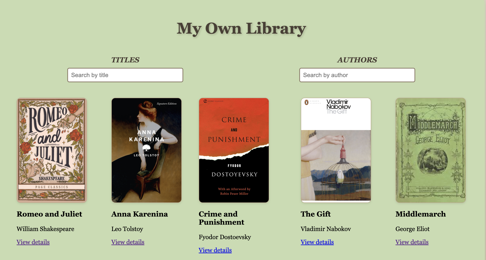

# 📚 My Own Library

**My Own Library** is a web application where users can collect and manage books by famous authors and writers.  
The app allows users to log in or register their own accounts and maintain a personalized book collection with reviews and descriptions.

---

## ✨ Features

- 👤 **User Authentication** – Sign up, log in, and manage your own account.  
- 📖 **Book Management** – Add new books to your collection, edit details, or delete them anytime.  
- 📝 **Personal Reviews** – Write your own book descriptions and reviews.  
- 🔍 **Explore Library** – Browse books from well-known authors.  
- 🛠️ **Admin Tools** – (Optional) Manage all books and user data.  

---

## 🧠 About the Project

This project was built as a full-stack application using **Express.js**, **EJS**, **CSS**, and **MongoDB**.  
It follows the MVC structure and includes authentication, CRUD operations, and dynamic rendering with EJS templates.  

The idea behind *My Own Library* is to create a personal digital library where readers can curate their favorite books and share their thoughts.

---

## 🧩 Tech Stack

- **Backend:** Express.js (Node.js)  
- **Frontend:** EJS, CSS  
- **Database:** MongoDB (Mongoose ODM)  
- **Templating:** EJS  
- **Session Management:** express-session  
- **Version Control:** Git & GitHub  

---

## 💡 Future Improvements & 🌐 Live Demo

### 🔮 Future Improvements
- Add book cover uploads with Cloudinary  
- Enable public profiles for users  
- Add category filters 
- Implement a dark/light mode  

### 🚀 Live Demo
👉 [My Own Library](https://your-app-link.com)